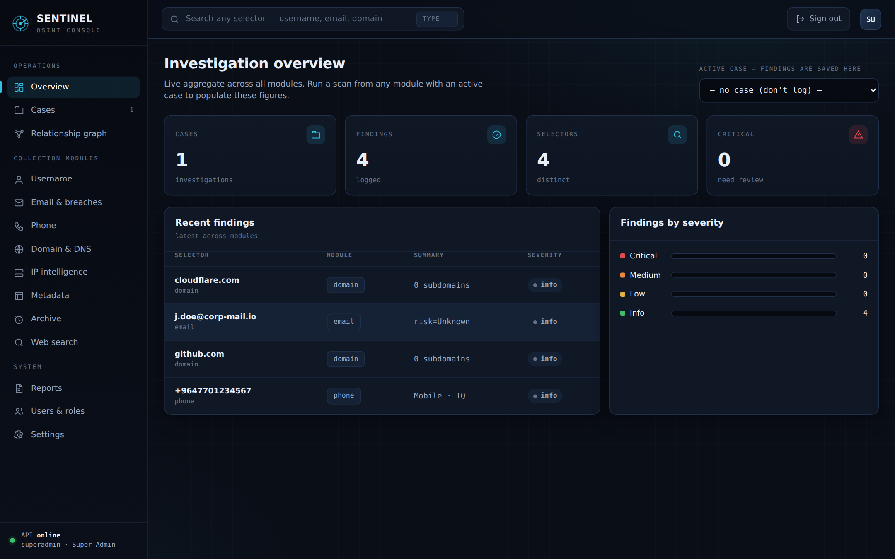
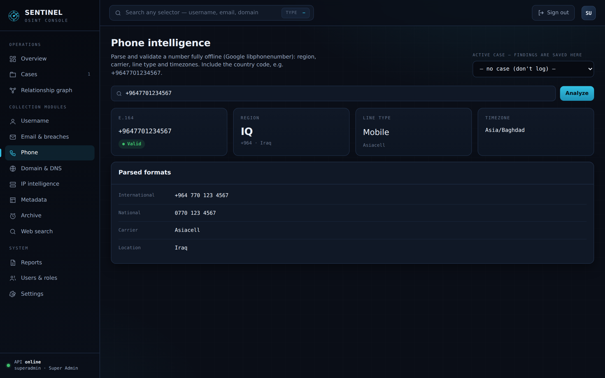
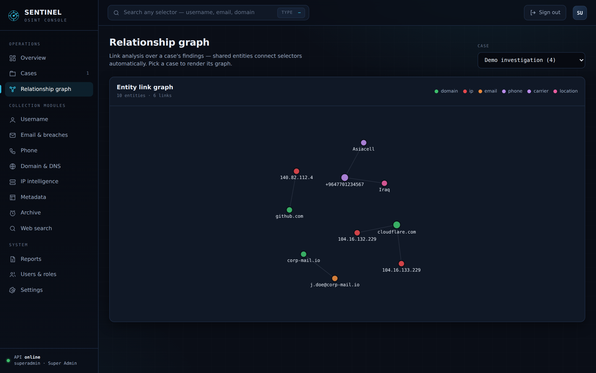
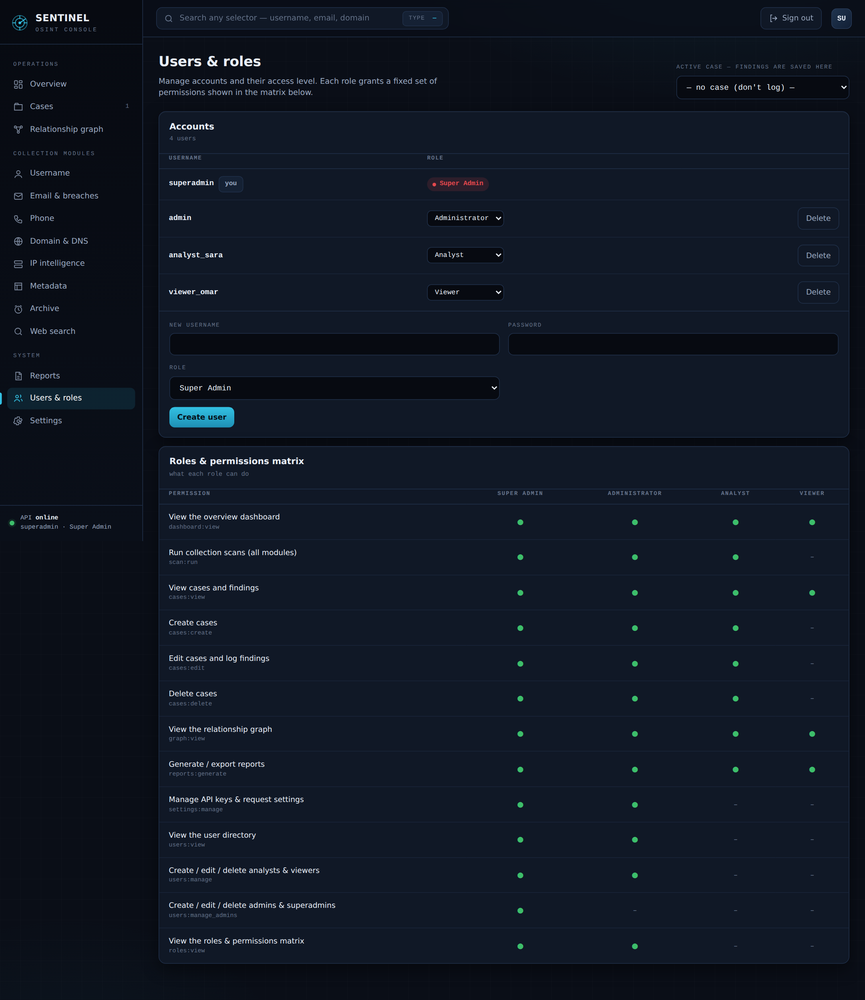

<div align="center">


### Self-hosted OSINT console — FastAPI backend, dark single-page UI, role-based access


</div>

Sentinel is a self-hosted OSINT console — a **FastAPI** backend that runs real
collection modules, wired to a **dark, single-page UI**. Log in, run a scan from
any module, save every finding into a case, visualise how the entities connect,
and export a report — all behind role-based access control.

> **Authorized use only.** Query selectors you own or are permitted to
> investigate. You are responsible for complying with each source's terms of
> service and with the laws that apply to you.

---

## Table of contents

- [Screens](#screens)
- [Features](#features)
- [Modules](#modules)
- [Roles & permissions](#roles--permissions)
- [Quick start](#quick-start)
- [Run with Docker](#run-with-docker)
- [API keys](#api-keys)
- [How data is stored](#how-data-is-stored)
- [Project layout](#project-layout)
- [API reference](#api-reference)
- [Troubleshooting](#troubleshooting)
- [License](#license)

---

## Screens

**Investigation overview** — live aggregate across every module.



| Phone intelligence (offline) | Relationship graph |
|---|---|
|  |  |

**Users, roles & permissions (RBAC)** — role assignment plus a full permission matrix.



---

## Features

- **10 collection modules** — username, email/breach, phone, domain/DNS, IP,
  metadata, archive, web search, plus a relationship graph.
- **Cases** — group findings from any module into one investigation.
- **Relationship graph** — an interactive link-analysis canvas built from a
  case's own findings; shared entities connect selectors automatically.
- **Reports** — export any case as **PDF**, **HTML** or **JSON**.
- **RBAC** — four roles, enforced server-side, with a live permission matrix.
- **Audit log** — every sign-in, scan and admin action recorded (who, when, IP).
- **Self-registration** — optional sign-up, saved and held for admin approval.
- **Universal search** — one box auto-detects the selector type (email, IP,
  domain, hash, phone, username) and routes to the right module.
- **Runs anywhere** — one `python run.py`, or one `docker compose up`.
- **No paid keys required** to start; optional keys unlock the richer sources.

**Tech stack:** FastAPI · Uvicorn · SQLite · PyJWT · dnspython · Pillow · pypdf ·
phonenumbers · reportlab · vanilla-JS single-page UI (no build step).

---

## Modules

| Module | Source | Needs a key? |
|---|---|---|
| **Username enumeration** | live HTTP checks across 20+ platforms | no |
| **Email & breaches** | format + MX validation · HaveIBeenPwned for breaches | HIBP for breaches only |
| **Phone intelligence** | offline parsing (libphonenumber): region, carrier, line type, timezones | no |
| **Domain & DNS** | live DNS records · subdomains from crt.sh (cert transparency) | no |
| **IP intelligence** | ip-api geolocation/ASN · Shodan for open ports | Shodan for ports only |
| **Metadata** | EXIF incl. GPS (images) · document properties (PDF) | no |
| **Archive & history** | Internet Archive / Wayback Machine | no |
| **Web search** | DuckDuckGo query builder + sitemap/robots inspection | no |
| **Relationship graph** | link analysis built from a case's own findings | no |

Everything degrades gracefully: a module that needs a key still returns what it
can and tells you which key unlocks the rest.

---

## Roles & permissions

Four built-in roles. The API enforces the **permission**, not the role name, and
the UI hides anything a user can't do.

| Role | Can |
|---|---|
| **Super Admin** | everything, including managing admins and other super admins |
| **Administrator** | all modules + cases + reports + API keys + manage analysts/viewers |
| **Analyst** | run all scans, create/edit/delete cases, generate reports, view graph |
| **Viewer** | read-only: cases, findings, graph, reports |

Manage users and see the full permission matrix under **Users & roles**
(visible to admins and super admins).

---

## Quick start

You need **Python 3.9+**.

```bash
# 1. install dependencies
cd sentinel-osint/backend
pip install -r requirements.txt

# 2. run it (from the project root)
cd ..
python run.py
```

Then open **http://127.0.0.1:8000** and sign in.

### First-run administrator

On the **first launch**, Sentinel creates a single **Super Admin** account
(`superadmin`) with a **randomly-generated password that is printed to the
server console once**:

```
==============================================================
  SENTINEL OSINT — first-run administrator account created
  username : superadmin
  password : <shown once in your terminal>
  ▸ Sign in, then change this password under Settings.
==============================================================
```

Copy that password, sign in, and change it under **Settings → Change my
password**. No credential is hard-coded anywhere in the source, and the password
is never stored in clear text. Additional users are created (or self-register
for approval) under **Users & roles**.

> Prefer to run uvicorn yourself?
> `cd backend && uvicorn main:app --reload --port 8000`

---

## Run with Docker

No Python setup needed — just Docker.

```bash
cd sentinel-osint
docker compose up -d          # builds the image and starts in the background
# open http://localhost:8000  (first-run admin password is printed in the logs)
docker compose logs -f        # follow logs
docker compose down           # stop (your data is preserved)
```

- **Image:** `python:3.11-slim` base, ~180–220 MB, runs uvicorn on port **8000**.
- **Persistence:** the `./data` folder is a mounted volume, so the SQLite
  database, `settings.json` and the JWT secret survive rebuilds and
  `docker compose down`. Delete `data/` to wipe everything.
- **API keys:** add them from the in-app **Settings** screen, or copy
  `.env.example` → `.env`, fill it in, and run
  `docker compose up -d --force-recreate`. `.env` and `data/` are never baked
  into the image.
- **Self-healing:** a `HEALTHCHECK` polls `/docs`; `restart: unless-stopped`
  brings the app back after a crash or host reboot.
- **Network:** the container needs outbound internet for the live modules
  (crt.sh, ip-api, archive.org, platform checks). DNS, phone, graph and PDF work
  offline.

Change the published port by editing the `ports:` line in `docker-compose.yml`
(e.g. `"9000:8000"`).

---

## API keys

All optional — the app runs without any of them. Add them under **Settings**
(admins only):

- **HaveIBeenPwned** — real breach records for the Email module → https://haveibeenpwned.com/API/Key
- **Shodan** — open ports & services for the IP module → https://account.shodan.io
- **VirusTotal** — IP / domain reputation → https://www.virustotal.com/gui/my-apikey

Keys are stored server-side in `data/settings.json` and are never sent back to
the browser in full. They can also be set as environment variables
(`HIBP_API_KEY`, `SHODAN_API_KEY`, `VIRUSTOTAL_API_KEY`) — see `.env.example`.

---

## How data is stored

Everything lives in the local `data/` folder (git-ignored):

- `sentinel.db` — SQLite database (users, cases, findings)
- `settings.json` — API keys and request settings
- `.jwt_secret` — signing key for login tokens (auto-generated)

Delete `data/sentinel.db` to reset all users and cases back to the defaults.

---

## Project layout

```
sentinel-osint/
├── run.py                    # launcher — python run.py
├── Dockerfile
├── docker-compose.yml
├── backend/
│   ├── main.py               # FastAPI app + all routes
│   ├── auth.py               # JWT login + permission enforcement
│   ├── permissions.py        # roles & permission matrix (RBAC)
│   ├── db.py                 # SQLite: users, cases, findings
│   ├── config.py             # settings + API-key management
│   ├── reporting.py          # PDF report generation (reportlab)
│   ├── requirements.txt
│   └── osint/                # the collection modules
│       ├── selectors.py      #   selector auto-detection
│       ├── username.py       #   platform enumeration
│       ├── email_breach.py   #   email + HIBP
│       ├── phone.py          #   offline phone parsing
│       ├── domain_dns.py     #   DNS + crt.sh subdomains
│       ├── ip_intel.py       #   ip-api + Shodan + VirusTotal
│       ├── metadata.py       #   EXIF / PDF
│       ├── archive.py        #   Wayback Machine
│       ├── websearch.py      #   query builder + site index
│       └── graph.py          #   relationship graph builder
├── frontend/
│   └── index.html            # the entire UI (single file)
├── docs/                     # logo + screenshots (for this README)
└── data/                     # created at runtime (git-ignored)
```

---

## API reference

All endpoints live under `/api` and require a bearer token (except login).
Interactive docs are always available at **http://127.0.0.1:8000/docs**.

```
# auth
POST   /auth/login                    → { token, user }
POST   /auth/register                 → self-registration (saved, pending approval)
GET    /auth/me
POST   /auth/password

# dashboard & detection
GET    /dashboard
GET    /detect?q=<selector>

# collection modules
POST   /scan/username    { username, case_id? }
POST   /scan/email       { email, case_id? }
POST   /scan/phone       { phone, region?, case_id? }
POST   /scan/domain      { domain, case_id? }
POST   /scan/ip          { ip, case_id? }
POST   /scan/archive     { url, case_id? }
POST   /scan/metadata    (multipart file, case_id?)
POST   /scan/websearch   { keywords, exact_phrase, sites[], filetype, date_from, date_to }
POST   /scan/siteindex   { domain }

# cases, graph & reports
GET/POST/PATCH/DELETE   /cases ...
GET    /cases/{id}                    → case + findings
GET    /cases/{id}/graph              → relationship graph (nodes + edges)
GET    /cases/{id}/report?format=pdf|html|json

# administration (permission-gated)
GET/POST/PATCH/DELETE   /users ...    → user & role management
PATCH  /users/{name}/active           → approve / disable an account
GET    /roles                         → roles & permission matrix
GET    /audit                         → activity trail (audit log)
GET/POST /settings                    → API keys & request settings
```

---

## Security

Sentinel ships with sensible hardening built in:

- **Authentication** — signed JWT sessions (12 h); passwords stored as
  PBKDF2-HMAC-SHA256 (200k rounds, per-user salt), never in clear text.
- **RBAC** — permissions enforced on every endpoint, not just hidden in the UI.
- **Password policy** — min 8 characters incl. letters and digits, on every
  password set or change.
- **Login rate-limiting** — 5 failed attempts per IP triggers a temporary lock
  (429), to blunt brute-force.
- **Self-registration is safe by default** — a new sign-up is saved but created
  as an **inactive, read-only (Viewer)** account that an admin must approve
  under **Users & roles** before it can log in.
- **Audit log** — every sign-in, scan and admin action is recorded (user, time,
  source IP) and viewable under **Audit log** (admins & super admins).
- **SSRF guards** — the IP and site-index modules refuse private, loopback and
  reserved targets, so the server can't be pointed at your internal network.
- **Security headers** — CSP, `X-Frame-Options`, `X-Content-Type-Options`,
  `Referrer-Policy`, `Permissions-Policy`, HSTS on every response.
- **Restricted CORS** — same-origin by default; widen with `ALLOWED_ORIGINS`.
- **Secrets never committed** — `data/` (DB, keys, JWT secret) and `.env` are
  git-ignored and excluded from the Docker image.

### HTTPS (production)

Run behind the bundled nginx reverse proxy with a self-signed certificate
(generated automatically on first start):

```bash
docker compose -f docker-compose.tls.yml up -d
# open https://localhost   (accept the self-signed certificate warning)
```

For a public domain, drop a CA-issued certificate (e.g. Let's Encrypt) into the
`sentinel-certs` volume as `server.crt` / `server.key`.

> Change the first-run `superadmin` password immediately, and set
> `ALLOWED_ORIGINS` to your real origin before exposing the app.

---

## Troubleshooting

**Scans return empty results.** The machine running the backend must reach the
internet directly. Corporate networks, VPN split-tunnels, or sandboxes with an
outbound allowlist will block sources like crt.sh, ip-api, archive.org and the
platform sites — DNS, phone, graph and PDF still work, the rest come back empty.
Set an HTTP proxy under **Settings** if you route traffic through one.

**`pip install` fails on a managed system.** Use a virtual environment:
`python -m venv venv && source venv/bin/activate`
(Windows: `venv\Scripts\activate`), then re-run the install.

---

## License

Released under the [MIT License](LICENSE). Authorized use only — see the notice
at the top of this file.
